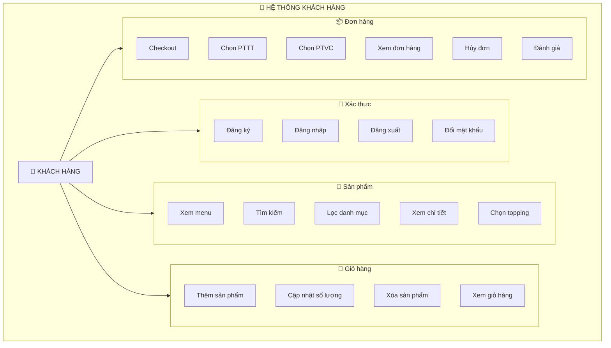
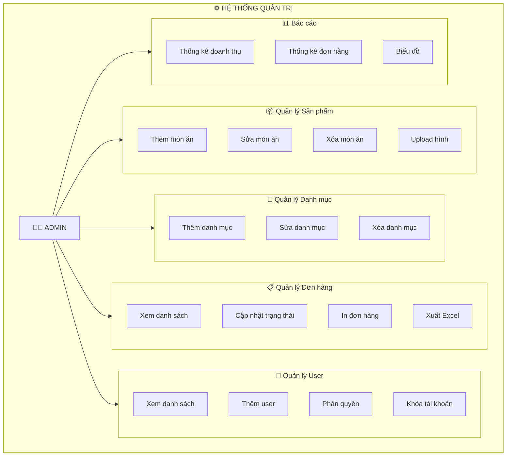
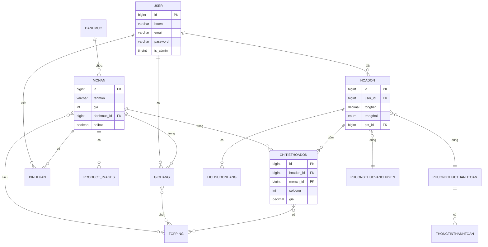

# 🍜 MYSHOP - HỆ THỐNG BÁN ĐỒ ĂN ONLINE

## 1. Tổng Quan Dự Án

| Thông tin | Chi tiết |
|-----------|----------|
| **Tên dự án** | MyShop - Food Ordering System |
| **Mô tả** | Website đặt đồ ăn online với quản lý đơn hàng |
| **Framework** | Laravel 8.x |
| **Ngôn ngữ** | PHP 7.3+ |
| **Database** | MySQL 5.7+ |
| **Frontend** | Blade Template, Bootstrap 5, jQuery |
| **Server** | Apache (XAMPP) |

---

## 2. Yêu Cầu Hệ Thống

| Thành phần | Yêu cầu |
|------------|---------|
| PHP | >= 7.3 |
| MySQL | >= 5.7 |
| Composer | >= 2.0 |
| Web Server | Apache/Nginx |
| Node.js | >= 14.x (tùy chọn) |

---

## 3. Kiến Trúc Hệ Thống

### 3.1 Kiến trúc 2 tầng (Client-Server)

```
┌─────────────────────────────────────────────────────────────┐
│                      CLIENT TIER                             │
│           (Trình duyệt Web - Browser)                       │
│                                                              │
│   • Giao diện HTML/CSS/JavaScript                           │
│   • Bootstrap 5 + jQuery                                     │
│   • Gửi HTTP Request đến Server                             │
└─────────────────────────────────────────────────────────────┘
                              ↓ ↑
                        HTTP Request/Response
                              ↓ ↑
┌─────────────────────────────────────────────────────────────┐
│                      SERVER TIER                             │
│              (Apache + PHP + MySQL)                          │
│                                                              │
│   • Laravel Framework (Controllers, Models, Views)          │
│   • Xử lý logic nghiệp vụ                                   │
│   • Truy xuất dữ liệu MySQL                                 │
│   • Trả về HTML/JSON cho Client                             │
└─────────────────────────────────────────────────────────────┘
```

---

## 4. Cấu Trúc Thư Mục

```
MyShop/
├── app/                        # Code ứng dụng
│   ├── Http/Controllers/       # Controllers xử lý request
│   │   ├── Admin/             # Controllers trang Admin
│   │   ├── AuthController.php
│   │   ├── CartController.php
│   │   ├── HomeController.php
│   │   ├── OrderController.php
│   │   ├── ProductController.php
│   │   └── ProfileController.php
│   ├── Models/                 # Eloquent Models (19 models)
│   │   ├── User.php, Product.php, Order.php, Cart.php...
│   ├── Services/              # Business Logic Services
│   └── Helpers/               # Helper functions
│
├── config/                     # Cấu hình ứng dụng
├── database/
│   ├── migrations/            # File tạo cấu trúc bảng
│   └── seeders/               # Dữ liệu mẫu
│
├── public/                     # Thư mục public
│   ├── assets/                # CSS, JS, Images
│   └── uploads/               # Hình ảnh upload
│
├── resources/views/            # Giao diện Blade
│   ├── layouts/               # Layout chính
│   ├── admin/                 # Views trang Admin
│   ├── auth/                  # Đăng nhập, Đăng ký
│   ├── cart/                  # Giỏ hàng
│   ├── orders/                # Đơn hàng
│   ├── products/              # Sản phẩm
│   └── home.blade.php         # Trang chủ
│
├── routes/
│   ├── web.php                # Route Frontend
│   └── admin.php              # Route Admin
│
└── storage/                    # File lưu trữ, logs
```

---

## 5. Chức Năng Hệ Thống

### 5.1 Phân Hệ Khách Hàng (Frontend)

| STT | Chức năng | Mô tả |
|:---:|-----------|-------|
| 1 | Đăng ký/Đăng nhập | Tạo tài khoản, xác thực người dùng |
| 2 | Xem sản phẩm | Duyệt menu, tìm kiếm, lọc theo danh mục |
| 3 | Chi tiết sản phẩm | Xem thông tin, hình ảnh, chọn topping |
| 4 | Giỏ hàng | Thêm, sửa, xóa sản phẩm |
| 5 | Đặt hàng | Checkout, chọn PTTT/PTVC |
| 6 | Quản lý đơn | Xem lịch sử, hủy đơn, đặt lại |
| 7 | Đánh giá | Viết bình luận, đánh giá sao |
| 8 | Tài khoản | Cập nhật thông tin, đổi mật khẩu |

### 5.2 Phân Hệ Quản Trị (Backend)

| STT | Chức năng | Mô tả |
|:---:|-----------|-------|
| 1 | Dashboard | Thống kê doanh thu, biểu đồ |
| 2 | Sản phẩm | CRUD món ăn, upload hình ảnh |
| 3 | Danh mục | CRUD danh mục sản phẩm |
| 4 | Topping | CRUD topping |
| 5 | Đơn hàng | Xem, cập nhật trạng thái, in đơn |
| 6 | Người dùng | CRUD users, phân quyền |
| 7 | Bình luận | Duyệt, ẩn, xóa bình luận |
| 8 | Tin tức | CRUD bài viết |
| 9 | Cài đặt | Logo, thông tin shop, PTTT, PTVC |

---

## 6. Sơ Đồ Phân Rã Chức Năng

### 📱 6.1 Phân Hệ Khách Hàng (User)



### 🔧 6.2 Phân Hệ Quản Trị (Admin)



---

## 7. Sơ Đồ Quan Hệ Thực Thể (ERD)



> **Chú thích:**
> - `||--o{` = Quan hệ **1:N** (One-to-Many)
> - `}o--o{` = Quan hệ **N:N** (Many-to-Many)
> - `PK` = Primary Key | `FK` = Foreign Key

---

## 8. Database

Hệ thống gồm **20 bảng** - Chi tiết xem file `database_documentation.md`

| STT | Tên bảng | Mô tả |
|:---:|----------|-------|
| 1 | user | Người dùng |
| 2 | danhmuc | Danh mục |
| 3 | monan | Sản phẩm (món ăn) |
| 4 | product_images | Hình ảnh sản phẩm |
| 5 | topping | Topping |
| 6 | monan_topping | Liên kết món-topping |
| 7 | giohang | Giỏ hàng |
| 8 | giohang_topping | Topping trong giỏ |
| 9 | hoadon | Đơn hàng |
| 10 | chitiethoadon | Chi tiết đơn hàng |
| 11 | chitiethoadon_topping | Topping trong chi tiết |
| 12 | phuongthucthanhtoan | Phương thức thanh toán |
| 13 | phuongthucvanchuyen | Phương thức vận chuyển |
| 14 | thongtinthanhtoan | Thông tin ngân hàng |
| 15 | binhluan | Bình luận/đánh giá |
| 16 | tintuc | Tin tức |
| 17 | gioithieu | Giới thiệu |
| 18 | quantri | Cài đặt hệ thống |
| 19 | lichsudonhang | Lịch sử đơn hàng |
| 20 | thongke_doanhthu | Thống kê doanh thu |

---

## 9. Phân Công Nhóm

Chi tiết xem file `Team_Assignment.md`

| Thành viên | Phụ trách |
|:----------:|-----------|
| TV1 | Xác thực, User, Cài đặt |
| TV2 | Sản phẩm, Danh mục, Topping |
| TV3 | Giỏ hàng, Đơn hàng, Giao diện, Database |
| TV4 | Bình luận, Tin tức, Báo cáo |

---

📝 *Cập nhật: 07/01/2026*

