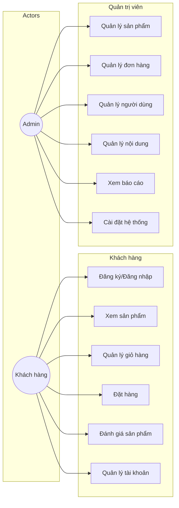
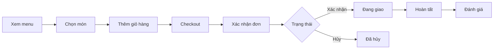
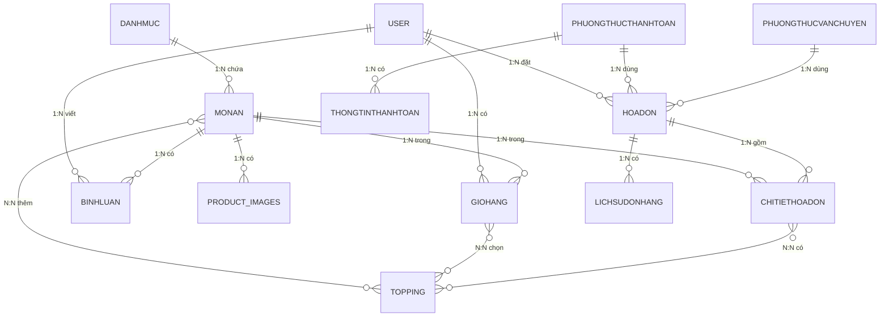
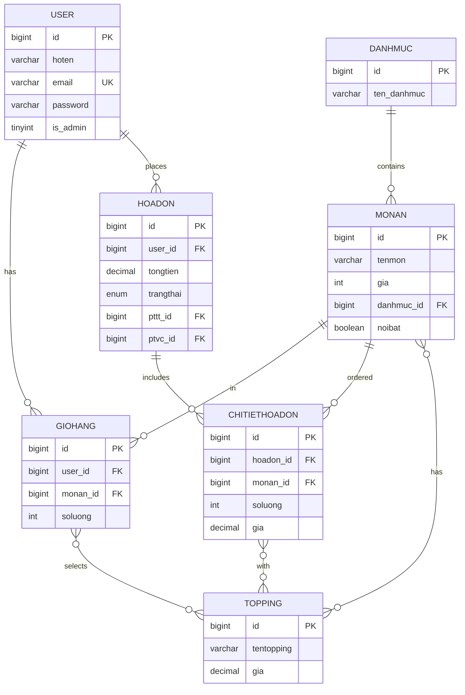
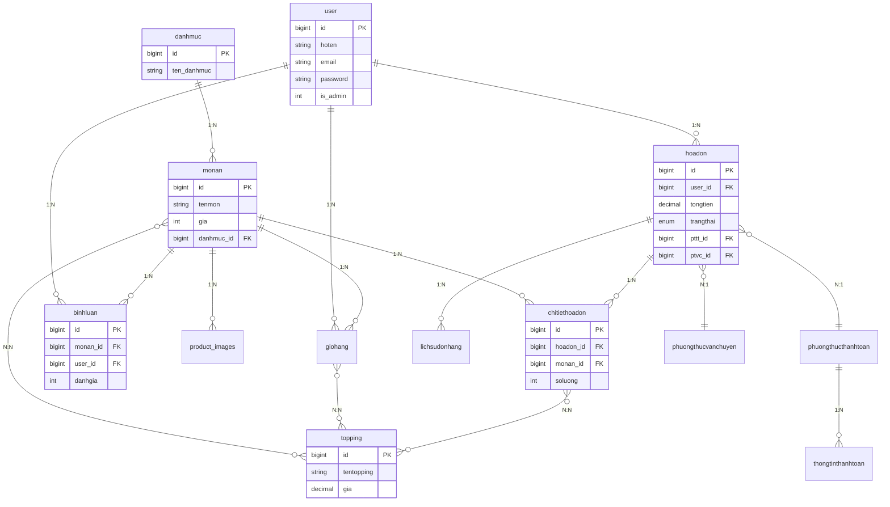
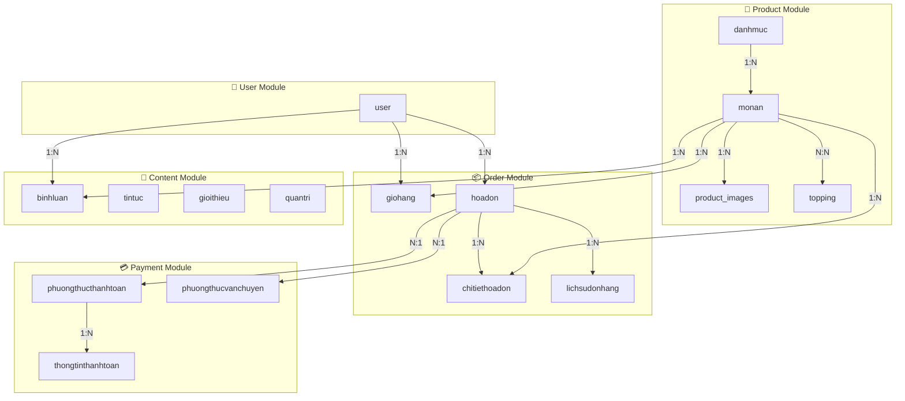

<h1 align="center">🍜 MyShop - Hệ Thống Bán Đồ Ăn Online</h1>

  
  
  
  

---

## 📋 Mục Lục

1. [Tổng Quan](#1-tổng-quan)
2. [Chức Năng Hệ Thống](#2-chức-năng-hệ-thống)
3. [Sơ Đồ Usecase](#3-sơ-đồ-usecase)
4. [Thiết Kế CSDL](#4-thiết-kế-csdl)
5. [Quan Hệ Giữa Các Bảng](#5-quan-hệ-giữa-các-bảng)
6. [Sơ Đồ ERD](#6-sơ-đồ-erd)

---

## 1. Tổng Quan

| Thông tin | Chi tiết |
|-----------|----------|
| **Tên dự án** | MyShop - Food Ordering System |
| **Mô tả** | Website đặt đồ ăn online với quản lý đơn hàng |
| **Framework** | Laravel 8.x |
| **Database** | MySQL (19 bảng) |
| **Phân hệ** | Frontend (Khách hàng) + Backend (Admin) |

---

## 2. Chức Năng Hệ Thống

### 2.1 Phân Hệ Khách Hàng

| Module | Chức năng |
|--------|-----------|
| **Xác thực** | Đăng ký, Đăng nhập, Đăng xuất |
| **Sản phẩm** | Xem menu, Chi tiết món, Tìm kiếm, Chọn topping |
| **Giỏ hàng** | Thêm/Xóa/Cập nhật sản phẩm |
| **Đơn hàng** | Checkout, Xem đơn, Hủy đơn, Đặt lại |
| **Đánh giá** | Viết bình luận, Đánh giá sao |
| **Tài khoản** | Cập nhật profile, Đổi mật khẩu |
| **Nội dung** | Xem tin tức, Giới thiệu, Liên hệ |

### 2.2 Phân Hệ Quản Trị

| Module | Chức năng |
|--------|-----------|
| **Dashboard** | Thống kê tổng quan, Biểu đồ doanh thu |
| **Sản phẩm** | CRUD món ăn, Quản lý hình ảnh, Sản phẩm nổi bật |
| **Danh mục** | CRUD danh mục |
| **Topping** | CRUD topping |
| **Đơn hàng** | Xem/Cập nhật trạng thái, In đơn, Xuất Excel |
| **Người dùng** | CRUD users, Phân quyền (Admin/Staff/Customer) |
| **Bình luận** | Duyệt/Ẩn/Xóa bình luận |
| **Tin tức** | CRUD bài viết |
| **Giới thiệu** | CRUD nội dung about |
| **Cài đặt** | Logo, Thông tin shop, Mạng xã hội, PTTT, PTVC |

---

## 3. Sơ Đồ Usecase

### 3.1 Tổng Quan Hệ Thống

### 3.2 Quy Trình Đặt Hàng

---

## 4. Thiết Kế CSDL

### 4.1 Danh Sách Bảng

| STT | Tên bảng | Mô tả | Quan hệ chính |
|:---:|----------|-------|---------------|
| 1 | `user` | Người dùng | 1-N với giohang, hoadon, binhluan |
| 2 | `danhmuc` | Danh mục | 1-N với monan |
| 3 | `monan` | Sản phẩm | 1-N với images, N-N với topping |
| 4 | `product_images` | Hình ảnh SP | N-1 với monan |
| 5 | `topping` | Topping | N-N với monan, giohang, chitiethoadon |
| 6 | `giohang` | Giỏ hàng | N-1 với user, monan |
| 7 | `hoadon` | Đơn hàng | N-1 với user, 1-N với chitiethoadon |
| 8 | `chitiethoadon` | Chi tiết đơn | N-1 với hoadon, monan |
| 9 | `binhluan` | Bình luận | N-1 với user, monan |
| 10 | `tintuc` | Tin tức | Độc lập |
| 11 | `gioithieu` | Giới thiệu | Độc lập |
| 12 | `quantri` | Cài đặt | Độc lập |
| 13 | `phuongthucthanhtoan` | PTTT | 1-N với hoadon |
| 14 | `phuongthucvanchuyen` | PTVC | 1-N với hoadon |
| 15 | `thongtinthanhtoan` | Thông tin bank | N-1 với PTTT |
| 16 | `lichsudonhang` | Lịch sử đơn | N-1 với hoadon |

### 4.2 Cấu Trúc Bảng Chính

#### Bảng `user`
| Cột | Kiểu | Mô tả |
|-----|------|-------|
| id | BIGINT PK | ID người dùng |
| hoten | VARCHAR(100) | Họ tên |
| email | VARCHAR(100) | Email (unique) |
| password | VARCHAR | Mật khẩu |
| is_admin | TINYINT | 0=Khách, 1=Admin, 2=Staff |
| trangthai | VARCHAR(50) | Hoạt động / Khóa |

#### Bảng `monan`
| Cột | Kiểu | Mô tả |
|-----|------|-------|
| id | BIGINT PK | ID sản phẩm |
| tenmon | VARCHAR(100) | Tên món |
| gia | INT | Giá hiện tại |
| giacu | INT | Giá cũ |
| danhmuc_id | BIGINT FK | ID danh mục |
| trangthai | VARCHAR(50) | Đang bán / Hết hàng |
| noibat | BOOLEAN | Sản phẩm nổi bật |

#### Bảng `hoadon`
| Cột | Kiểu | Mô tả |
|-----|------|-------|
| id | BIGINT PK | ID đơn hàng |
| user_id | BIGINT FK | ID khách hàng |
| tongtien | DECIMAL(12,2) | Tổng tiền |
| diachi_giaohang | VARCHAR(255) | Địa chỉ giao |
| trangthai | ENUM | Chờ xác nhận → Hoàn tất / Đã hủy |
| pttt_id | BIGINT FK | Phương thức thanh toán |
| ptvc_id | BIGINT FK | Phương thức vận chuyển |
| dathanhtoan | BOOLEAN | Đã thanh toán |

#### Bảng `chitiethoadon`
| Cột | Kiểu | Mô tả |
|-----|------|-------|
| id | BIGINT PK | ID chi tiết |
| hoadon_id | BIGINT FK | ID đơn hàng |
| monan_id | BIGINT FK | ID sản phẩm |
| soluong | INT | Số lượng |
| gia | DECIMAL(10,2) | Đơn giá |

---

## 5. Sơ Đồ Quan Hệ Giữa Các Bảng

### 5.1 Sơ Đồ Quan Hệ (Crow's Foot Notation)

> **Chú thích ký hiệu:**
> - `||--o{` = Quan hệ **1:N** (One-to-Many)
> - `}o--o{` = Quan hệ **N:N** (Many-to-Many)

### 5.2 Sơ Đồ Chi Tiết Theo Nhóm

---

## 6. Sơ Đồ ERD

### 6.1 Sơ Đồ Quan Hệ Tổng Thể

### 6.2 Sơ Đồ Nhóm Theo Module

---

## 7. Công Nghệ

| Thành phần | Công nghệ |
|------------|-----------|
| Backend | Laravel 8, PHP 7.3+ |
| Database | MySQL 5.7+ |
| Frontend | Blade, Bootstrap 5 |
| Charts | Chart.js |
| Server | Apache (XAMPP) |

---

<em>📝 Tài liệu cập nhật: 01/01/2026</em>

